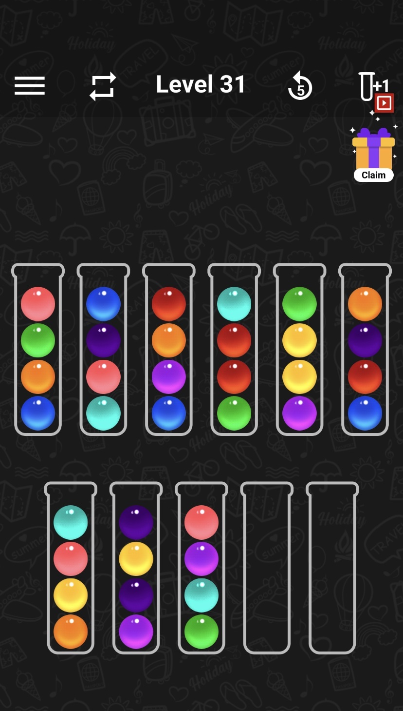

# color-sort

This is a brute-force breadth first search to solve the game "color sort".

This program was created because my friend and I were stuck on level 31. This level is shown below:



This level is represented in `src/input.txt` as follows. The first line represents the number of fully empty tubes (2), and each subsequent line represents a tube filled with different colored balls, from bottom to top of the tube. The mapping from colors to numbers is arbitrary.

```txt
2
1234
5461
1728
3885
7993
1862
2945
7696
3574
```

The 11 tubes are labelled 0-10, with 0 being the top-left tube and 10 being the bottom left tube.
The shortest solution is 35 moves:

```txt
Move from 0 to 9,
Move from 4 to 0,
Move from 4 to 10,
Move from 4 to 10,
Move from 8 to 9,
Move from 4 to 8,
Move from 7 to 4,
Move from 7 to 10,
Move from 7 to 4,
Move from 8 to 7,
Move from 8 to 7,
Move from 6 to 8,
Move from 6 to 9,
Move from 6 to 10,
Move from 5 to 6,
Move from 5 to 4,
Move from 2 to 5,
Move from 2 to 6,
Move from 2 to 7,
Move from 1 to 2,
Move from 1 to 4,
Move from 1 to 9,
Move from 3 to 1,
Move from 8 to 1,
Move from 8 to 1,
Move from 0 to 8,
Move from 0 to 8,
Move from 0 to 6,
Move from 0 to 2,
Move from 3 to 0,
Move from 3 to 0,
Move from 3 to 8,
Move from 5 to 0,
Move from 5 to 0,
Move from 5 to 2.
```
